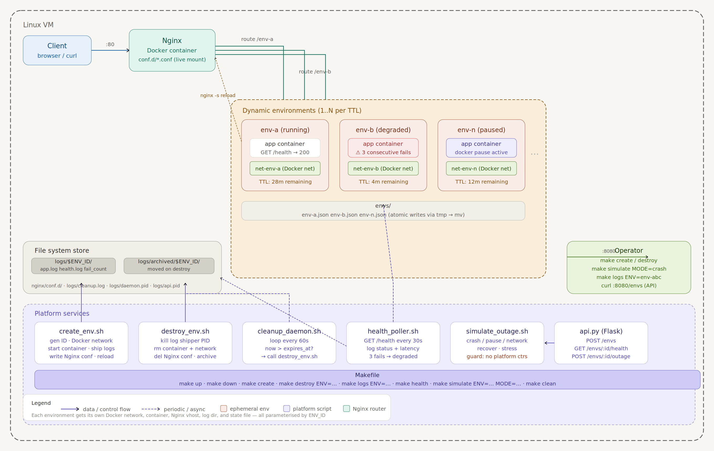

# DevOps Sandbox Platform

A self-service platform for spinning up isolated temporary environments, monitoring their health, simulating outages, and destroying everything automatically. Think of it as a miniature internal Heroku with a chaos engineering toggle. Every environment is short-lived by design. If a reviewer cannot spin it up with one command, it does not count.

## Architecture



## How It Works

Every environment is an isolated Docker container with its own network, port, Nginx route, logs, and expiry timer. When you create an environment, the platform assigns it a unique ID, a dedicated Docker network, and a port starting from 3000. Nginx gets a new config file and reloads automatically. A cleanup daemon checks every 60 seconds whether any environment has exceeded its TTL and destroys it automatically. A health poller hits every environment's /health endpoint every 30 seconds and marks it degraded after 3 consecutive failures. The FastAPI control API exposes all operations over HTTP so you can manage the platform remotely.

## Prerequisites

- Ubuntu 22.04+ EC2 instance (t2.small or larger)
- Ports 22, 80, 8000, and 3000-3100 open in your EC2 security group
- Docker and Docker Compose plugin installed
- Python 3 with FastAPI and uvicorn

## Installation

```bash
# 1. Clone the repository
git clone https://github.com/Precious000/devops-sandbox.git
cd devops-sandbox

# 2. Install system dependencies
sudo apt update
sudo apt install -y docker.io python3-pip curl jq make git
sudo systemctl enable --now docker
sudo usermod -aG docker ubuntu
newgrp docker

# 3. Install Docker Compose plugin
sudo apt install -y ca-certificates curl gnupg
curl -fsSL https://download.docker.com/linux/ubuntu/gpg | \
  sudo gpg --dearmor -o /etc/apt/keyrings/docker.gpg
sudo apt update
sudo apt install -y docker-compose-plugin

# 4. Install Python dependencies
pip3 install fastapi uvicorn --break-system-packages

# 5. Build the demo app image
cd demo-app
docker build -t sandbox-app:latest .
cd ..

# 6. Configure your environment
cp .env.example .env
nano .env
# Set SANDBOX_HOST_IP to your EC2 public IP
# Set SANDBOX_BASE_PORT to 3000
```

## Quick Start — Zero to First Running Environment

```bash
make up        # start the entire platform
make create    # create your first environment
make health    # check its health status
curl http://localhost:8000/envs   # list all environments via API
```

## Makefile Commands

| Command | Description |
|---|---|
| `make up` | Start Nginx, cleanup daemon, health poller, and API |
| `make down` | Stop everything and destroy all active environments |
| `make create` | Create a new environment — prompts for name and TTL |
| `make destroy ENV=env-xxx` | Destroy a specific environment immediately |
| `make logs ENV=env-xxx` | Tail live logs for a specific environment |
| `make health` | Show health status and TTL remaining for all environments |
| `make simulate ENV=env-xxx MODE=crash` | Run outage simulation |
| `make clean` | Wipe all state files, logs, and archives |

## API Endpoints

| Method | Endpoint | Description |
|---|---|---|
| POST | `/envs` | Create a new environment |
| GET | `/envs` | List all active environments with TTL remaining |
| DELETE | `/envs/:id` | Destroy a specific environment |
| GET | `/envs/:id/logs` | Last 100 lines of the environment app log |
| GET | `/envs/:id/health` | Last 10 health check results |
| POST | `/envs/:id/outage` | Trigger outage simulation |

### API Examples

```bash
# Create environment via API
curl -X POST http://localhost:8000/envs \
  -H "Content-Type: application/json" \
  -d '{"name": "myapp", "ttl": 30}'

# List all environments
curl http://localhost:8000/envs | python3 -m json.tool

# Get logs
curl http://localhost:8000/envs/env-xxx/logs

# Get health
curl http://localhost:8000/envs/env-xxx/health

# Trigger crash
curl -X POST http://localhost:8000/envs/env-xxx/outage \
  -H "Content-Type: application/json" \
  -d '{"mode": "crash"}'

# Destroy environment
curl -X DELETE http://localhost:8000/envs/env-xxx
```

## Full Demo Walkthrough

### 1. Start the platform
```bash
make up
```

### 2. Create an environment
```bash
make create
# Enter name: myapp
# Enter TTL in minutes: 30
```

### 3. Access the environment directly
```bash
curl http://YOUR-EC2-IP:3000/
curl http://YOUR-EC2-IP:3000/health
```

### 4. Check health status
```bash
make health
tail -f logs/env-xxx/health.log
```

### 5. Simulate a crash outage
```bash
make simulate ENV=env-xxx MODE=crash
# Watch health monitor detect it within 90 seconds
tail -f logs/env-xxx/health.log
```

### 6. Recover the environment
```bash
make simulate ENV=env-xxx MODE=recover
# Watch health checks return to 200 OK
tail -f logs/env-xxx/health.log
```

### 7. Check the cleanup daemon
```bash
tail -f logs/cleanup.log
```

### 8. Destroy manually
```bash
make destroy ENV=env-xxx
```

### 9. Watch auto-destroy
Create an environment with a short TTL and watch the daemon destroy it:
```bash
# Create with 2 minute TTL
make create   # enter TTL: 2
tail -f logs/cleanup.log
# After 2 minutes the environment destroys itself automatically
```

### 10. Tear down the platform
```bash
make down
```

## Outage Simulation Modes

| Mode | What it does | How to recover |
|---|---|---|
| `crash` | Kills the container dead — simulates a hard crash | `make simulate ENV=xxx MODE=recover` |
| `pause` | Freezes the container — requests hang indefinitely | `make simulate ENV=xxx MODE=recover` |
| `network` | Disconnects container from Docker network — requests time out | `make simulate ENV=xxx MODE=recover` |
| `recover` | Restarts, unpauses, or reconnects whatever was broken | — |

## Log Shipping

This platform uses Approach A — simple log shipping via docker logs. On environment creation, `docker logs -f CONTAINER_ID >> logs/ENV_ID/app.log` is started as a background process. The PID is stored in the environment state file and killed cleanly on environment destruction to prevent zombie processes. On destroy, logs are archived to `logs/archived/ENV_ID/`. Logs are queryable by environment ID using `make logs ENV=env-xxx` or via the API at `GET /envs/:id/logs`.

## Project Structure
devops-sandbox/
├── platform/
│   ├── create_env.sh        # spin up isolated environment
│   ├── destroy_env.sh       # tear down and clean up
│   ├── cleanup_daemon.sh    # background TTL expiry checker
│   ├── simulate_outage.sh   # chaos engineering tool
│   └── api.py               # FastAPI control API
├── nginx/
│   ├── nginx.conf           # main config with conf.d include
│   └── conf.d/              # auto-generated per-env configs
├── monitor/
│   └── health_poller.sh     # 30s health check loop
├── demo-app/
│   ├── app.py               # Flask app with /health endpoint
│   ├── requirements.txt
│   └── Dockerfile
├── logs/                    # gitignored
│   └── archived/
├── envs/                    # runtime state files, gitignored
├── Makefile
├── .env                     # never committed
├── .env.example             # committed template
├── .gitignore
└── README.md

## Environment State File

Every active environment has a state file at `envs/ENV_ID.json`:

```json
{
  "id": "env-1778406023-1981",
  "name": "myapp",
  "port": 3000,
  "created_at": 1778406023,
  "ttl": 1800,
  "status": "running",
  "log_pid": 33932
}
```

- `created_at` is a Unix timestamp
- `ttl` is in seconds
- `status` is one of running, degraded
- `log_pid` is the PID of the background log shipping process

## Known Limitations

- Runs on a single VM — not horizontally scalable
- Port range 3000-3100 limits simultaneous environments to 100
- Log shipping uses a simple background process rather than a proper aggregator like Loki or Fluentd
- No authentication on the API — anyone with access to port 8000 can manage environments
- Nginx uses host networking which works on a single VM but needs rethinking in a multi-host setup
- No persistent storage — all environment state is lost if the VM reboots unexpectedly
